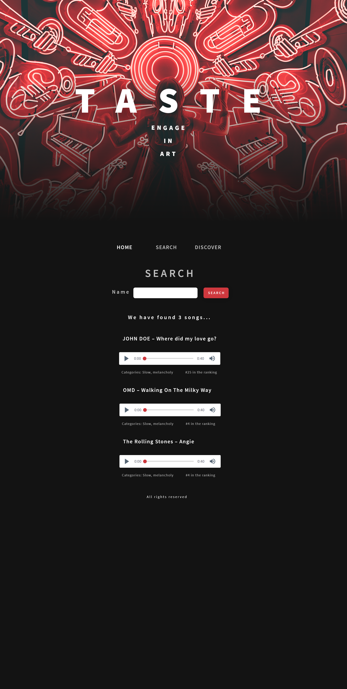
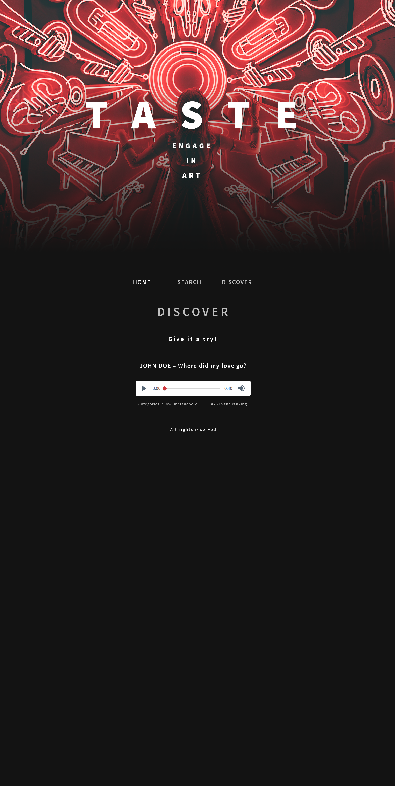

🎶 PROJECT "MUSIC SERVICE"

🎧 Application for service with music. 

💻 Live demo: https://musicservice-5dff.onrender.com

(!) Free hosting so might take a while to load for first time.

✔ Used Technologies:
JavaScript,
HTML,
CSS/SASS.

➜ Features:
Homepage,
Search,
Discover,
WEB API.

👀 Screenshots:

📸 Home

📸 Search

📸 Discover

✉ Contact:

Created by Viktoryia Vysotskaya 

➽ radevich.vika2014@gmail.com

➽ https://www.linkedin.com/in/viktoryia-vysotskaya
